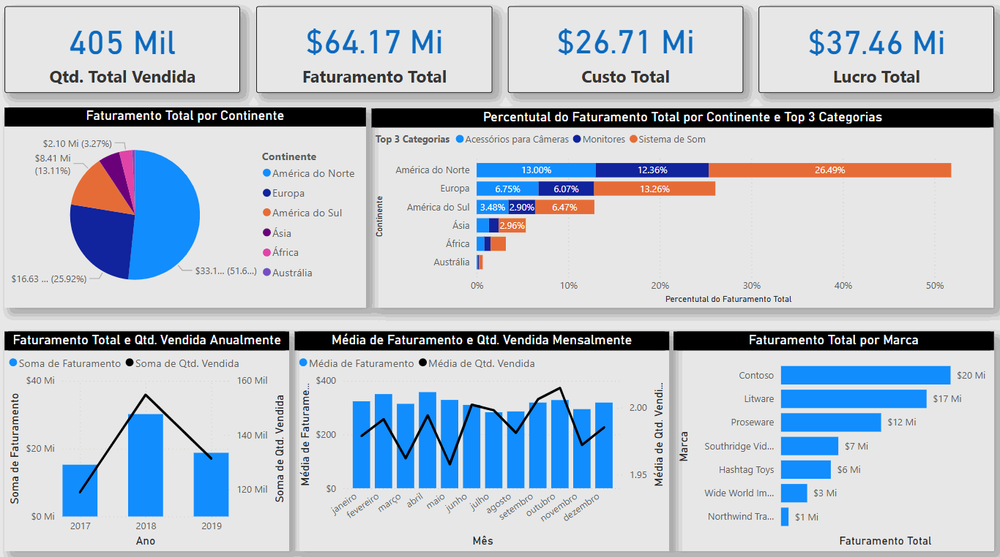

# Power BI Dashboards Portfolio

Welcome to my Power BI portfolio! This repository showcases data visualization projects focused on transforming raw datasets into insightful dashboards. Each project uses real-world or simulated datasets and demonstrates key Power BI capabilities like DAX, relationships, dynamic visuals, and storytelling.

---

## 🗂️ Index

- 📦 Dashboards Overview
  - [📈 Business Sales Dashboard](#business-sales)
  - [💰 Personal Finance Dashboard](#personal-finance)
- [📥 How to Use](#how-to-use)
- [📫 Contact](#contact)

---

## 📦 Dashboards Overview

### 📈 Business Sales Dashboard

The **Business Sales** dashboard is a basic yet insightful sales analysis tool designed to showcase my Power BI skills beyond introductory training. While the dataset was originally provided during the _Power BI Impressionador Week by Hashtag Treinamentos_, I independently redesigned the dashboard structure, layout, and storytelling to enhance data interpretation and business insights. The dataset consists of individual sales records, including:

- Product sold
- Date
- Unit price and unit cost
- Quantity sold
- Product category
- Brand
- Country and continent
- 
**📊 Dataset Size:** 203,883 rows 
#### 🧠 Insights and Features:
- **Key Metrics Cards**: Total revenue, profit, and units sold are displayed at the top for quick performance assessment.
- **Sales by Continent**: Visual breakdown of global performance showing strong revenue concentration in North America and Europe.
- **Top Categories by Region**: Comparative analysis of product category dominance per continent.
- **Annual and Monthly Trends**: Time-series graphs provide insights into seasonality and annual sales performance.
- **Brand Performance**: The horizontal bar chart highlights the best-selling brands, such as Contoso and Litware.

#### 🎥 Dashboard Preview:

**📁 [Access Business Sales Folder](./business-sales/)**

---

### Personal Finance Dashboard

Coming soon...

---

## 📥 How to Use

To explore any dashboard:

1. Download both the `.pbix` file **and** the corresponding dataset from the project folder.
2. Open the `.pbix` file using [Power BI Desktop](https://powerbi.microsoft.com/en-us/desktop/).
3. If necessary, update the data source path to match the location of the dataset on your computer.
4. Refresh the data and start exploring the insights!

---

## Contact

- 
- 

