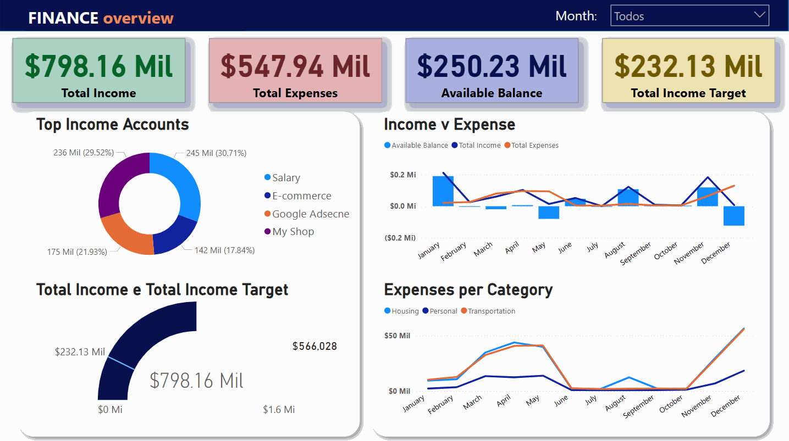

# Power BI Dashboards Portfolio

Welcome to my Power BI portfolio! This repository showcases data visualization projects focused on transforming raw datasets into insightful dashboards. Each project uses real-world or simulated datasets and demonstrates key Power BI capabilities like DAX, relationships, dynamic visuals, and storytelling.

---

## 🗂️ Index

- 📦 Dashboards Overview
  - [📈 Business Sales Dashboard](#business-sales)
  - [💰 Personal Finance Dashboard](#personal-finance)
  - [🏦 Multi-Bank Transactions Dashboard](#multi-bank-transactions)
- [📥 How to Use](#how-to-use)
- [📫 Contact](#contact)

---

## 📦 Dashboards Overview

### 📈 Business Sales Dashboard

The **Business Sales** dashboard is a basic yet insightful sales analysis tool designed to showcase my Power BI skills beyond introductory training. While the dataset was originally provided during the _Power BI Impressionador Week by Hashtag Treinamentos_, I independently redesigned the dashboard structure, layout, and storytelling to enhance data interpretation and business insights. The dataset consists of individual sales records, including:

- Product sold
- Date
- Unit price and unit cost
- Quantity sold
- Product category
- Brand
- Country and continent

**📊 Dataset Size:** 203,883 rows 
#### 🧠 Insights and Features:
- **Key Metrics Cards**: Total revenue, profit, and units sold are displayed at the top for quick performance assessment.
- **Sales by Continent**: Visual breakdown of global performance showing strong revenue concentration in North America and Europe.
- **Top Categories by Region**: Comparative analysis of product category dominance per continent.
- **Annual and Monthly Trends**: Time-series graphs provide insights into seasonality and annual sales performance.
- **Brand Performance**: The horizontal bar chart highlights the best-selling brands, such as Contoso and Litware.

#### 🎥 Dashboard Preview:

**📁 [Access Business Sales Folder](./business-sales/)**

---

### 💰 Personal Finance Dashboard

The **Personal Finance** dashboard is a custom financial planning tool designed to track and analyze monthly income, expenses, and savings. It was inspired by the [Data With Decision YouTube channel](https://www.youtube.com/@datalab365), but the layout, visuals, and business logic were independently expanded and customized to enhance storytelling and decision-making. The dataset includes the following columns:

- Month  
- Main Type (Income or Expense)  
- Category  
- Sub-category  
- Amount  
- Bill Due Date  
- Status  

**📊 Dataset Size:** 300 rows

#### 🧠 Insights and Features:
- **Key Performance Cards**: Total income, expenses, target income, and available balance for the selected period
- **Top Income Sources**: Pie chart showing income distribution across categories such as Salary, E-commerce, Google AdSense, and others
- **Income vs. Expense**: Line and column combo chart tracking cash flow trends over the year
- **Budget Tracking**: Gauge comparing actual income vs. target income
- **Category Breakdown**: Expense trends over time by category (Housing, Personal, Transportation)
- **Dynamic Month Filter**: Interactive slicer to filter all visuals by selected month

#### 🎥 Dashboard Preview:

**📁 [Access Personal Finance Folder](./personal-finance/)**

---

### 🏦 Multi-Bank Transactions Dashboard

The **Multi-Bank Transactions** dashboard will focus on consolidating and analyzing financial transactions across multiple bank accounts. 

Coming soon...

---

## 📥 How to Use

To explore any dashboard:

1. Download both the `.pbix` file **and** the corresponding dataset from the project folder.
2. Open the `.pbix` file using [Power BI Desktop](https://powerbi.microsoft.com/en-us/desktop/).
3. If necessary, update the data source path to match the location of the dataset on your computer.
4. Refresh the data and start exploring the insights!

---

## Contact

If you have suggestions, ideas, or have found any issues in the dashboards, feel free to [open an issue](https://github.com/LeonardoJFigueiredo/portfolio/issues) or reach out through the contacts below:

- 
- 

